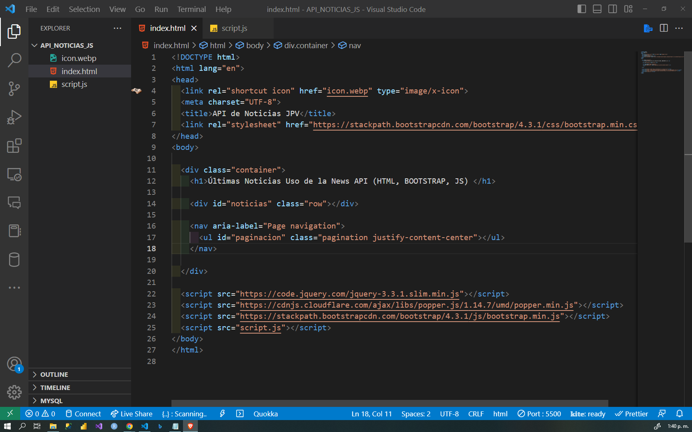

# USO_DE_API_DE_NOTICIAS
USO DE API DE NOTICIAS CON HTML, BOOTSTRAP Y JAVASCRIPT.

Este proyecto es una aplicación web que utiliza la API de NewsAPI para mostrar las noticias principales de los Estados Unidos en tiempo real. La aplicación utiliza JavaScript para recuperar los datos de la API y mostrarlos en una página web dinámica y responsiva. La aplicación también incluye una funcionalidad de paginación para que los usuarios puedan ver más noticias y una función de búsqueda para buscar noticias específicas.

La aplicación utiliza una combinación de HTML, CSS y JavaScript para crear una interfaz de usuario atractiva y fácil de usar. Las noticias se muestran en una cuadrícula de tarjetas que incluyen una imagen, el título de la noticia, una descripción y un botón "Leer más" que lleva al usuario a la noticia completa. La aplicación también muestra botones de paginación para que los usuarios puedan navegar por las noticias y una barra de búsqueda para buscar noticias específicas.

Este proyecto es una excelente manera de aprender cómo utilizar APIs en aplicaciones web y cómo crear una interfaz de usuario atractiva y responsiva utilizando HTML, CSS y JavaScript. También es una herramienta útil para mantenerse actualizado con las últimas noticias de los Estados Unidos en tiempo real.

## IMAGENES DEL PROYECTO

## IMAGENES DEL PROYECTO

## IMAGENES DEL PROYECTO

